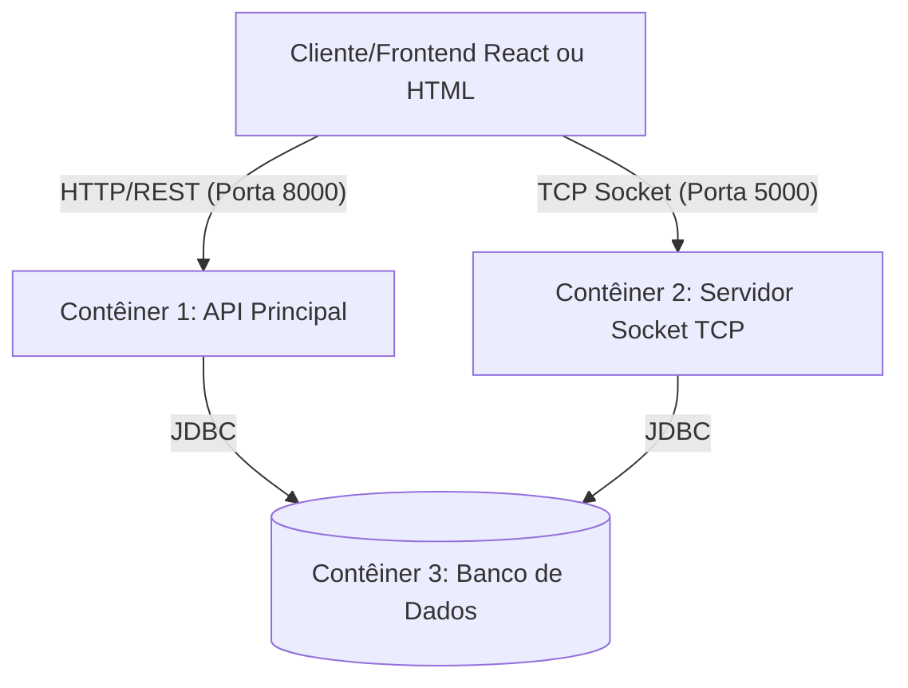
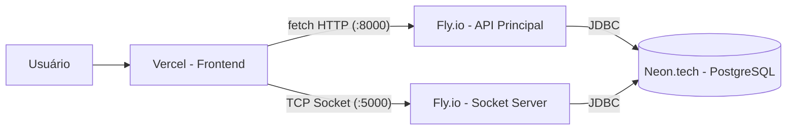

# Documentação de Arquitetura do Backend - Help Desk

Este documento detalha a arquitetura do backend para o sistema de Help Desk (Projeto Integrador IV). A solução adota uma arquitetura baseada em contêineres Docker e foi projetada para ser desenvolvida em **Java Puro** (sem frameworks robustos como Spring Boot ou Hibernate).

---

## 1. Visão Geral da Arquitetura

O sistema será dividido em 3 contêineres principais, isolando responsabilidades, separando requisições assíncronas (tempo real) das síncronas (operações CRUD) e persistindo dados:

1. **Contêiner 1 (API Principal - Porta 8000)**: API HTTP para gerenciar operações normais de sistema.
2. **Contêiner 2 (Servidor Socket TCP - Porta 5000)**: Servidor de Sockets para o fluxo de chamados em tempo real, notificações e atualizações de status.
3. **Contêiner 3 (Banco de Dados - Porta 5432)**: Banco relacional para dados de longo prazo (PostgreSQL).



---

## 2. Stack Tecnológica (Java Puro)

Para atender ao requisito de "Java Puro", as tecnologias recomendadas são:

* **Contêiner 1 (API HTTP):** Uso nativo da biblioteca `com.sun.net.httpserver.HttpServer` embutida no JDK ou Java EE básico via `Servlets` (Tomcat/Jetty leve). JSON será manipulado via uma biblioteca pura como `Gson` ou `Jackson`.
* **Contêiner 2 (Socket Server):** Classes padrão `java.net.ServerSocket` e `java.net.Socket`. Gerenciamento de múltiplas conexões via multithreading com `java.util.concurrent` (Thread Pools).
* **Banco de Dados (Contêiner 3):** Recomendado usar **PostgreSQL (5432)**. A conexão será feita exclusivamente usando **JDBC** nativo (sem ORM). Queries em SQL puro (`PreparedStatement`).

---

## 3. Especificação dos Contêineres

### 3.1. Contêiner 1: API Principal (Porta: 8000)
Responsável pelas regras de negócio síncronas, CRUD de chamados, e autenticação de usuários.

**Endpoints sugeridos:**

| Método | Rota | Descrição |
| :--- | :--- | :--- |
| `POST` | `/api/login` | Recebe usuário e senha, devolve um token (ex: JWT ou SessionID). |
| `POST` | `/api/chamados` | Cria um novo chamado no banco de dados. |
| `GET` | `/api/chamados` | Lista todos os chamados abertos (com filtro para cliente ou atendente). |
| `GET` | `/api/chamados/{id}`| Pega detalhes de um chamado específico e histórico básico. |
| `PUT` | `/api/chamados/{id}`| Atualiza o status do chamado (ex: de "Novo" para "Atribuído" ou "Fechado"). |

**Fluxo no Java:**
O client faz a requisição -> `HttpHandler` do Java captura -> Valida dados -> Conecta no banco via `JDBC` -> Grava/Lê dados -> Retorna string JSON para o Frontend.

### 3.2. Contêiner 2: Servidor Socket TCP (Porta: 5000)
Responsável pelo fluxo de chamados em tempo real: criação, atribuição, atualização de status e notificações para os usuários conectados. **Não há chat** — em ambiente corporativo a comunicação ocorre por ferramentas como Microsoft Teams.

**Como funciona (Fluxo de TCP Puro em Java):**
1. O servidor Java inicializa um `ServerSocket(5000)`.
2. Fica em um loop infinito `while(true) { Socket cliente = serverSocket.accept(); }` aguardando conexões.
3. Quando um usuário faz login no front-end, ele se conecta nesse socket para acompanhar os chamados em tempo real.
4. O servidor Java passa esse `Socket` para uma nova Thread (`ClientHandler`).
5. A Thread mantém a conexão aberta, escuta requisições (`InputStream`) e envia atualizações (`OutputStream`).

**Padrão de Comunicação (Payload JSON via TCP):**
As mensagens trafegadas no socket devem seguir uma estrutura JSON para fácil leitura no Java:
```json
{
  "type": "STATUS_CHANGE",
  "ticketId": 105,
  "newStatus": "ASSIGNED",
  "message": "O chamado #0105 foi atribuído ao técnico Carlos Mendes.",
  "timestamp": "2026-08-15T10:30:00Z"
}
```
*O Socket Server trabalha em conjunto com a API Principal (Contêiner 1): sempre que um chamado for criado, atribuído ou tiver seu status alterado, o Socket Server faz o broadcast em tempo real para os usuários conectados relevantes, além de persistir as operações via JDBC.*

### 3.3. Contêiner 3: Banco de Dados (Porta: 5432)
Recomenda-se PostgreSQL. Ele suporta a alta concorrência gerada pela API e pelo Socket.

**Modelagem de Dados:** Consultar a documentação completa em [database_modeling.md](./database_modeling.md).

**Tabelas do sistema (5 tabelas):**

| Tabela | Finalidade |
|:---|:---|
| `users` | Usuários (CLIENT, SUPPORT, ADMIN) |
| `categories` | Categorias de chamados (Hardware, Software, Rede, etc.) |
| `tickets` | Chamados de suporte |
| `ticket_timeline` | Histórico de eventos do chamado |
| `notifications` | Notificações do sistema |

**Fluxo de Status dos Chamados:**
```
NEW → ASSIGNED → CLOSED
                 └→ UNRESOLVED
```

---

## 4. Integração dos Contêineres (Docker Compose)

Para rodar todo esse backend, o projeto deverá ter um arquivo `docker-compose.yml` na raiz, orquestrando tudo:

```yaml
version: '3.8'

services:
  db:
    image: postgres:15-alpine
    container_name: helpdesk_db
    environment:
      POSTGRES_USER: root
      POSTGRES_PASSWORD: rootpassword
      POSTGRES_DB: helpdesk
    ports:
      - "5432:5432"
    volumes:
      - pgdata:/var/lib/postgresql/data

  api_principal:
    build: ./backend-api
    container_name: helpdesk_api
    ports:
      - "8000:8000"
    depends_on:
      - db
    environment:
      - DB_URL=jdbc:postgresql://db:5432/helpdesk
      - DB_USER=root
      - DB_PASS=rootpassword

  socket_server:
    build: ./backend-socket
    container_name: helpdesk_socket
    ports:
      - "5000:5000"
    depends_on:
      - db
    environment:
      - DB_URL=jdbc:postgresql://db:5432/helpdesk
      - DB_USER=root
      - DB_PASS=rootpassword

volumes:
  pgdata:
```

## 5. Estratégia de Deploy (Produção)

Todos os serviços serão hospedados em plataformas gratuitas, acessíveis de qualquer lugar (casa, faculdade, etc.).

### Visão Geral

| Componente | Plataforma | Custo | URL de Acesso |
|:---|:---|:---|:---|
| **Frontend** (HTML/CSS/JS) | Vercel | Grátis | `https://help-desk-pi-iv.vercel.app` |
| **API Principal** (Java, :8000) | Fly.io | Grátis | `https://helpdesk-api.fly.dev` |
| **Socket Server** (Java, :5000) | Fly.io | Grátis | `helpdesk-socket.fly.dev:5000` |
| **Banco de Dados** (PostgreSQL) | Neon.tech | Grátis | Connection string via painel |



### 5.1. Frontend — Vercel

- Deploy automático via integração com o GitHub (push na `main` → redeploy)
- CDN global, HTTPS automático, sem cold start
- O frontend faz requisições ao backend via URL do Fly.io:
```js
// Exemplo de chamada no frontend
fetch("https://helpdesk-api.fly.dev/api/chamados")
```

### 5.2. Backend Java — Fly.io

- Suporta **Docker** e **portas TCP customizadas** (essencial pro Socket Server)
- 3 micro VMs gratuitas (256MB RAM cada) — **não desliga por inatividade**
- Cada contêiner Java (API e Socket) roda como um serviço separado no Fly.io
- Variáveis de ambiente (`DB_URL`, `DB_USER`, `DB_PASS`) configuradas via `fly secrets set`

> **Por que Fly.io e não Render?** O Render free tier só suporta HTTP e desliga após 15min parado. O Fly.io suporta TCP puro e mantém o serviço sempre ativo — essencial para o Socket Server.

### 5.3. Banco de Dados — Neon.tech

- PostgreSQL serverless na nuvem, sem instalar nada
- Free tier com 0.5 GB de armazenamento (mais que suficiente pro PI)
- Connection string no formato:
```
jdbc:postgresql://ep-xxx.us-east-2.aws.neon.tech/helpdesk?user=user&password=senha&sslmode=require
```

### 5.4. Docker Compose (Desenvolvimento Local)

O `docker-compose.yml` da seção anterior continua sendo usado para **desenvolvimento local**. Em produção, cada serviço roda na sua respectiva plataforma.

---

## 6. Próximos Passos (Para Implementação)
1. Criar duas pastas separadas no repositório backend: `backend-api` e `backend-socket`.
2. Em ambas, adicionar os drivers do PostgreSQL (`postgresql.jar`) e do Gson (`gson.jar`) se não for usar Maven/Gradle.
3. Criar os `Dockerfiles` dentro de cada uma dessas pastas, compilando os arquivos `.java` com `javac` e executando com `java`.
4. Criar conta no [Neon.tech](https://neon.tech) e provisionar o banco PostgreSQL.
5. Rodar o script `create_tables.py` apontando para a connection string do Neon.
6. Fazer deploy dos contêineres Java no [Fly.io](https://fly.io) via `flyctl deploy`.
7. Configurar o projeto no [Vercel](https://vercel.com) apontando para o repositório GitHub.
