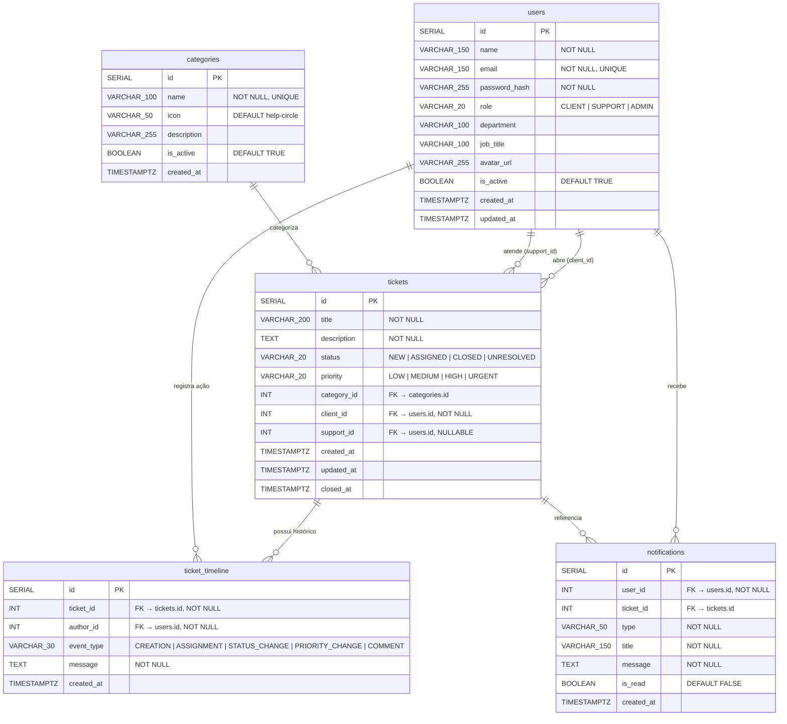

# Modelagem de Banco de Dados — Help Desk PI IV

> **SGBD:** PostgreSQL 15+  
> **Conexão:** JDBC Nativo (sem ORM)  
> **Porta padrão:** 5432  

Este documento descreve a modelagem relacional proposta para o sistema de Help Desk, baseada na [backend_architecture.md](./backend_architecture.md) e na estrutura de dados do frontend.

---

## Diagrama Entidade-Relacionamento (DER)



---

## Dicionário de Dados

### 1. `users` — Usuários do Sistema

Armazena todos os usuários: clientes que abrem chamados, técnicos de suporte e administradores.

| Coluna | Tipo | Constraints | Descrição |
|:---|:---|:---|:---|
| `id` | `SERIAL` | `PRIMARY KEY` | Identificador único auto-incremental |
| `name` | `VARCHAR(150)` | `NOT NULL` | Nome completo do usuário |
| `email` | `VARCHAR(150)` | `NOT NULL, UNIQUE` | E-mail corporativo (usado no login) |
| `password_hash` | `VARCHAR(255)` | `NOT NULL` | Hash da senha (BCrypt recomendado) |
| `role` | `VARCHAR(20)` | `NOT NULL, CHECK` | Perfil de acesso: `CLIENT`, `SUPPORT` ou `ADMIN` |
| `department` | `VARCHAR(100)` | — | Departamento do colaborador (ex: TI, Financeiro, RH) |
| `job_title` | `VARCHAR(100)` | — | Cargo (ex: Analista de Suporte) |
| `avatar_url` | `VARCHAR(255)` | — | URL da foto de perfil (futuro) |
| `is_active` | `BOOLEAN` | `DEFAULT TRUE` | Controle de ativação sem exclusão física |
| `created_at` | `TIMESTAMPTZ` | `DEFAULT CURRENT_TIMESTAMP` | Data de criação do registro |
| `updated_at` | `TIMESTAMPTZ` | `DEFAULT CURRENT_TIMESTAMP` | Atualizado automaticamente via trigger |

**Índices recomendados:**
- `idx_users_email` → `email`
- `idx_users_role` → `role`

---

### 2. `categories` — Categorias de Chamados

Classificação dos chamados para triagem e geração de relatórios.

| Coluna | Tipo | Constraints | Descrição |
|:---|:---|:---|:---|
| `id` | `SERIAL` | `PRIMARY KEY` | Identificador único |
| `name` | `VARCHAR(100)` | `NOT NULL, UNIQUE` | Nome da categoria (ex: Hardware, Software) |
| `icon` | `VARCHAR(50)` | `DEFAULT 'help-circle'` | Nome do ícone Feather Icons usado no frontend |
| `description` | `VARCHAR(255)` | — | Descrição da categoria |
| `is_active` | `BOOLEAN` | `DEFAULT TRUE` | Ativar/desativar sem deletar |
| `created_at` | `TIMESTAMPTZ` | `DEFAULT CURRENT_TIMESTAMP` | Data de criação |

**Valores iniciais previstos:**

| id | name | icon |
|:---|:---|:---|
| 1 | Hardware | `monitor` |
| 2 | Software | `code` |
| 3 | Rede | `wifi` |
| 4 | Acesso | `key` |
| 5 | E-mail | `mail` |
| 6 | Outros | `help-circle` |

---

### 3. `tickets` — Chamados de Suporte

Tabela central do sistema. Representa o ciclo de vida completo de um chamado.

| Coluna | Tipo | Constraints | Descrição |
|:---|:---|:---|:---|
| `id` | `SERIAL` | `PRIMARY KEY` | Identificador único do chamado |
| `title` | `VARCHAR(200)` | `NOT NULL` | Título resumido do problema |
| `description` | `TEXT` | `NOT NULL` | Descrição detalhada do chamado |
| `status` | `VARCHAR(20)` | `NOT NULL, DEFAULT 'NEW', CHECK` | Estado atual do chamado |
| `priority` | `VARCHAR(20)` | `NOT NULL, DEFAULT 'MEDIUM', CHECK` | Nível de prioridade |
| `category_id` | `INT` | `FK → categories(id), ON DELETE SET NULL` | Categoria do chamado |
| `client_id` | `INT` | `NOT NULL, FK → users(id), ON DELETE RESTRICT` | Quem abriu o chamado |
| `support_id` | `INT` | `FK → users(id), ON DELETE SET NULL` | Técnico responsável (`NULL` até atribuição) |
| `created_at` | `TIMESTAMPTZ` | `DEFAULT CURRENT_TIMESTAMP` | Data de abertura |
| `updated_at` | `TIMESTAMPTZ` | `DEFAULT CURRENT_TIMESTAMP` | Última modificação (trigger automático) |
| `closed_at` | `TIMESTAMPTZ` | — | Data de encerramento (preenchida ao fechar) |

**Valores possíveis de `status`:**

| Valor | Descrição | Correspondência no Frontend |
|:---|:---|:---|
| `NEW` | Chamado recém-criado, aguardando atribuição | `novo` |
| `ASSIGNED` | Chamado atribuído a um técnico de suporte/infra | `atribuido` |
| `CLOSED` | Problema solucionado e chamado encerrado | `fechado` |
| `UNRESOLVED` | Não solucionado, negado ou sem resolução viável | `nao_solucionado` |

**Fluxo de Status:**

```
 NEW → ASSIGNED → CLOSED
                  └→ UNRESOLVED
```

**Valores possíveis de `priority`:**

| Valor | Correspondência no Frontend |
|:---|:---|
| `LOW` | `baixa` |
| `MEDIUM` | `media` |
| `HIGH` | `alta` |
| `URGENT` | `urgente` |

**Índices recomendados:**
- `idx_tickets_status` → `status`
- `idx_tickets_priority` → `priority`
- `idx_tickets_client_id` → `client_id`
- `idx_tickets_support_id` → `support_id`
- `idx_tickets_category_id` → `category_id`
- `idx_tickets_created_at` → `created_at DESC`

---

### 4. `ticket_timeline` — Histórico / Trilha de Auditoria

Registra todos os eventos que acontecem no chamado: criação, atribuições, mudanças de status e comentários.

| Coluna | Tipo | Constraints | Descrição |
|:---|:---|:---|:---|
| `id` | `SERIAL` | `PRIMARY KEY` | Identificador único do evento |
| `ticket_id` | `INT` | `NOT NULL, FK → tickets(id), ON DELETE CASCADE` | Chamado relacionado |
| `author_id` | `INT` | `NOT NULL, FK → users(id), ON DELETE RESTRICT` | Quem realizou a ação |
| `event_type` | `VARCHAR(30)` | `NOT NULL, CHECK` | Tipo do evento |
| `message` | `TEXT` | `NOT NULL` | Descrição textual da ação |
| `created_at` | `TIMESTAMPTZ` | `DEFAULT CURRENT_TIMESTAMP` | Quando o evento ocorreu |

**Valores possíveis de `event_type`:**

| Valor | Descrição | Correspondência Frontend (`tipo`) |
|:---|:---|:---|
| `CREATION` | Chamado foi criado | `criacao` |
| `ASSIGNMENT` | Técnico foi atribuído | `atribuicao` |
| `STATUS_CHANGE` | Status foi alterado | `status` |
| `PRIORITY_CHANGE` | Prioridade foi alterada | — |
| `COMMENT` | Comentário adicionado | `comentario` |

**Índices recomendados:**
- `idx_timeline_ticket_id` → `ticket_id`
- `idx_timeline_created_at` → `created_at ASC`

---

---

### 5. `notifications` — Notificações do Sistema

Armazena alertas e notificações exibidas no header do painel para cada usuário.

| Coluna | Tipo | Constraints | Descrição |
|:---|:---|:---|:---|
| `id` | `SERIAL` | `PRIMARY KEY` | Identificador único |
| `user_id` | `INT` | `NOT NULL, FK → users(id), ON DELETE CASCADE` | Destinatário da notificação |
| `ticket_id` | `INT` | `FK → tickets(id), ON DELETE CASCADE` | Chamado relacionado (opcional) |
| `type` | `VARCHAR(50)` | `NOT NULL` | Tipo de notificação |
| `title` | `VARCHAR(150)` | `NOT NULL` | Título resumido |
| `message` | `TEXT` | `NOT NULL` | Texto da notificação |
| `is_read` | `BOOLEAN` | `DEFAULT FALSE` | Se já foi lida |
| `created_at` | `TIMESTAMPTZ` | `DEFAULT CURRENT_TIMESTAMP` | Data de criação |

**Valores comuns de `type`:**

| Valor | Descrição |
|:---|:---|
| `chamado_novo` | Um novo chamado foi aberto |
| `status_alterado` | O status de um chamado mudou |
| `comentario` | Novo comentário em um chamado |
| `atribuicao` | Chamado atribuído ao usuário |

| `resolvido` | Chamado foi resolvido |

**Índices recomendados:**
- `idx_notifications_user` → `(user_id, is_read)`
- `idx_notifications_created_at` → `created_at DESC`

---

## Trigger Recomendado: `updated_at` Automático

Para as tabelas `users` e `tickets`, recomenda-se criar uma função + trigger que atualize automaticamente a coluna `updated_at` a cada `UPDATE`:

```sql
CREATE OR REPLACE FUNCTION update_updated_at_column()
RETURNS TRIGGER AS $$
BEGIN
    NEW.updated_at = CURRENT_TIMESTAMP;
    RETURN NEW;
END;
$$ LANGUAGE plpgsql;
```

Aplicar nas tabelas:
```sql
CREATE TRIGGER trg_users_updated_at
    BEFORE UPDATE ON users
    FOR EACH ROW EXECUTE FUNCTION update_updated_at_column();

CREATE TRIGGER trg_tickets_updated_at
    BEFORE UPDATE ON tickets
    FOR EACH ROW EXECUTE FUNCTION update_updated_at_column();
```

---

## Mapeamento Frontend ↔ Banco de Dados

| Estrutura Frontend (`data.js`) | Tabela PostgreSQL |
|:---|:---|
| `USERS[]` | `users` |
| `CATEGORIAS[]` | `categories` |
| `STATUS_LIST[]` | Valores do `CHECK` em `tickets.status` |
| `PRIORIDADES[]` | Valores do `CHECK` em `tickets.priority` |
| `chamados[]` | `tickets` |
| `chamados[].timeline[]` | `ticket_timeline` |
| `notificacoes[]` | `notifications` |

---

## Regras de Integridade

| Regra | Implementação |
|:---|:---|
| E-mail único por usuário | `UNIQUE` em `users.email` |
| Chamado sempre tem solicitante | `NOT NULL` em `tickets.client_id` |
| Técnico pode não estar atribuído | `NULLABLE` em `tickets.support_id` |
| Deletar chamado remove histórico e notificações | `ON DELETE CASCADE` em `ticket_timeline` e `notifications` |
| Não pode deletar usuário com chamados | `ON DELETE RESTRICT` em `tickets.client_id` |
| Status e prioridade controlados | `CHECK` constraints nos valores permitidos |
| Categoria removida limpa FK | `ON DELETE SET NULL` em `tickets.category_id` |
